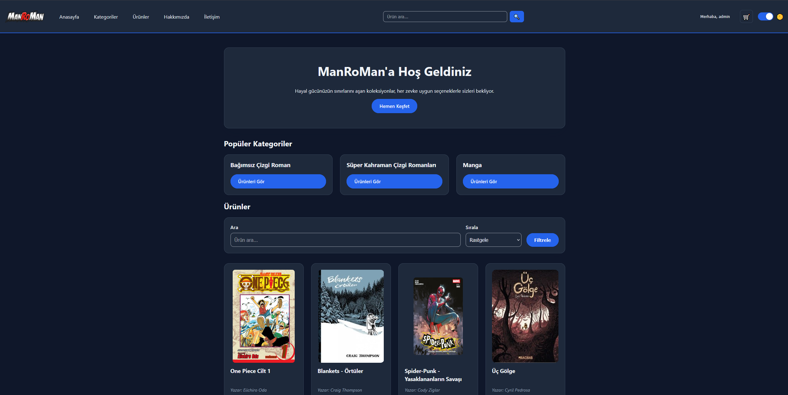
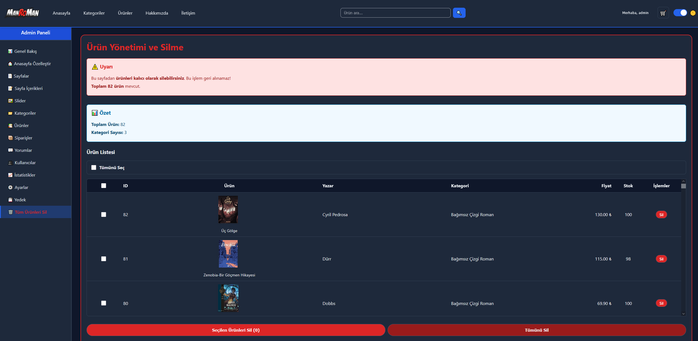
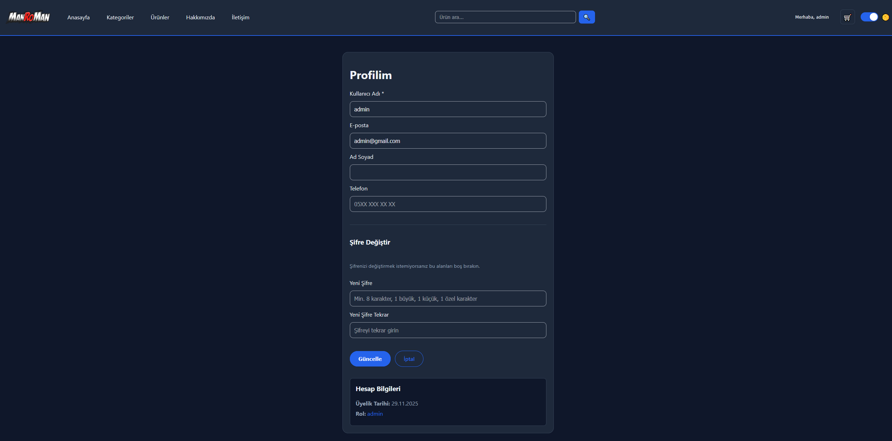
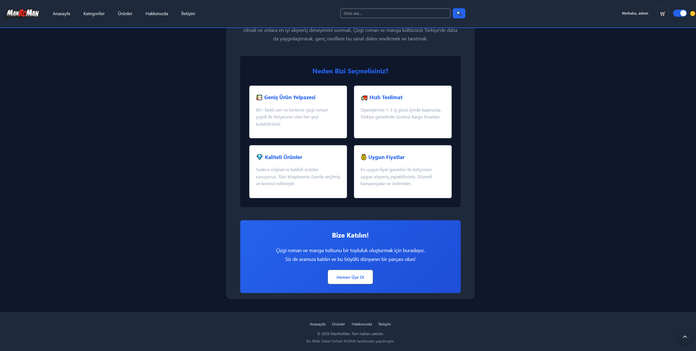
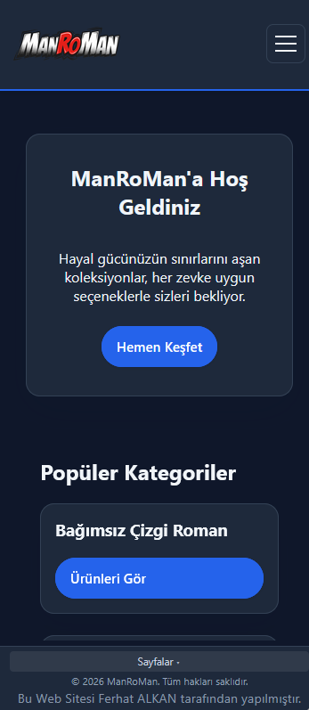
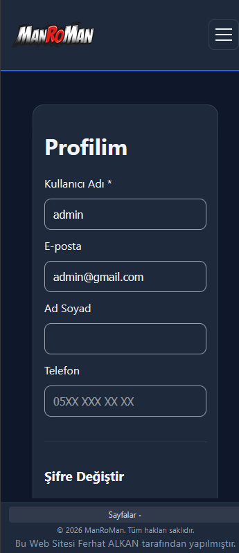
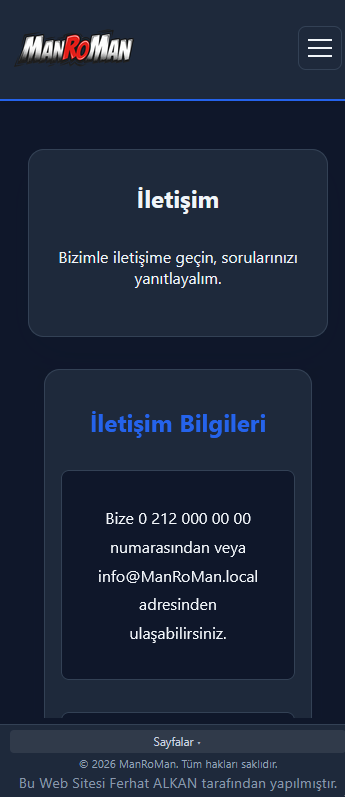
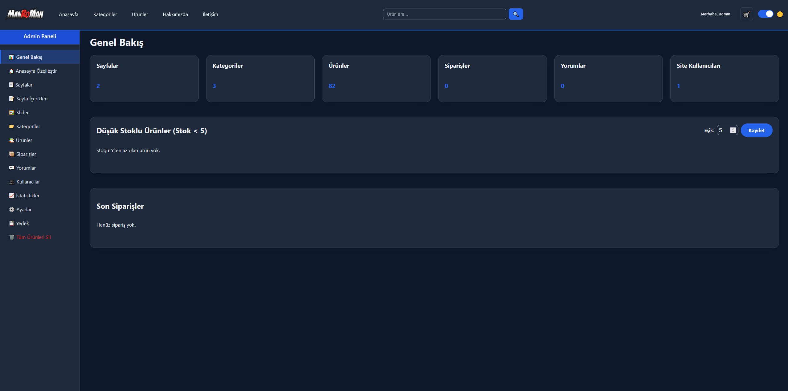
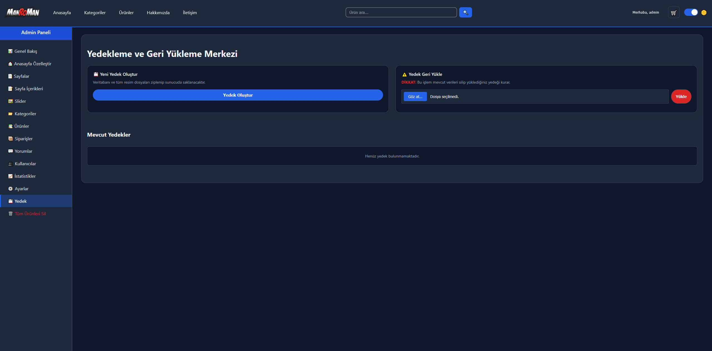

# PHP & MySQL E-Ticaret / CMS Projesi

!!Proje Amatör bir projedir önemli eksiklikler olabilir ücretsiz şekilde kullanabilirsiniz.!!

## Proje Hakkında

**Mini Shop** – PDO altyapılı, tam responsive (mobil uyumlu), yönetim panelli dinamik e-ticaret sistemi.

**Geliştirici:** Ferhat ALKAN

## Öne Çıkan Özellikler

### Frontend
- Tam responsive tasarım (mobil, tablet, desktop)
- Accordion yapılı mobil menü (hamburger menü)
- Dark Mode (Karanlık Mod) desteği
- WebP resim formatı desteği
- SEO uyumlu URL yapısı (slug: `/urun/`, `/kategori/`, `/sayfa/`)
- AJAX ile sepete ekleme ve sayfa yenilemeden filtreleme/sıralama
- Ürün yorumları, puanlama ve AJAX ile yorum sıralama
- Kullanıcı profil yönetimi, adresler ve sipariş takibi
- Anasayfa slider, popüler kategoriler ve ürünler (admin panelden yapılandırılır)

### Backend & Güvenlik
- PDO Prepared Statements (SQL Injection koruması)
- XSS koruması (`htmlspecialchars`, `sanitize()`)
- CSRF koruması (tüm formlar ve AJAX endpoint’leri: giriş, kayıt, ödeme, profil, sepet, yorum, admin formları)
- Güvenli session yönetimi (HttpOnly, SameSite=Strict)
- Şifre hash’leme (Bcrypt)
- Şifre kuralları: min. 8 karakter, 1 büyük harf, 1 küçük harf, 1 özel karakter

### Yönetim Paneli
- Ürün, Kategori, Sayfa yönetimi (CRUD)
- Sipariş takibi ve durum güncelleme
- Yorum onaylama/reddetme
- Anasayfa özelleştirme (popüler kategoriler,başlıklar)
- Slider yönetimi
- Veritabanı yedekleme ve geri yükleme (ZIP, uploads dahil)
- Site istatistikleri ve ziyaret takibi
- Admin profil

### SEO
- **robots.txt:** Admin, migrations, backups ve config.php engelli; Sitemap satırı (canlıda domain ile güncelleyin)
- **Sitemap:** `sitemap.php` – anasayfa, ürünler, kategoriler, statik sayfalar (XML)
- **Meta:** Description, canonical URL, robots index/follow
- **Open Graph ve Twitter Card:** Paylaşım önizlemesi (başlık, açıklama, görsel)
- **Yapısal veri (JSON-LD):** WebSite + Organization (tüm sayfalar), Product (ürün sayfası, fiyat, stok, puan)
- Slug tabanlı temiz URL’ler (`/urun/`, `/kategori/`, `/sayfa/`)

## Hızlı Kurulum

### 1. Veritabanı Kurulumu
- XAMPP’te **Apache** ve **MySQL**’i başlatın
- phpMyAdmin’de mini_shop adında bir veritabanı oluşturup mini_shop.sql dosyasını içe aktarın
### 2. Ayarlar
`config.php` varsayılan olarak ortam değişkenlerini kullanır; yoksa yerel değerler geçerlidir. İsteğe bağlı ortam değişkenleri:

- `DB_HOST` – Veritabanı sunucusu (varsayılan: localhost)
- `DB_NAME` – Veritabanı adı (varsayılan: mini_shop)
- `DB_USER` – Kullanıcı adı (varsayılan: root)
- `DB_PASS` – Şifre (varsayılan: boş)
- `BASE_URL` – Proje URL yolu (varsayılan: /mini_shop)

Doğrudan düzenlemek için `config.php` içindeki `getenv()` varsayılan değerlerini değiştirin.

## Varsayılan Giriş Bilgileri
(yeni kayıt/şifre değişikliğinde: min. 8 karakter, 1 büyük, 1 küçük, 1 özel karakter)<br>
Varsayılan standart kullanıcı adı user <br>
Varsayılan standart kullanıcı şifre user123<br>
Varsayılan admin kullanıcı adı admin<br>
Varsayılan admin şifre admin123

- **Frontend:** `http://localhost/mini_shop`
- **Admin Panel:** `http://localhost/mini_shop/admin/dashboard.php`

### Canlıya Alma (Production)
- `config.php` içinde `define('IS_PRODUCTION', true);` kullanın veya sunucuda `APP_ENV=production` ortam değişkenini ayarlayın
- Hata mesajları kullanıcıya gösterilmez
- Session çerezleri HTTPS’te `Secure` ile ayarlanır

## Ekran Görüntüleri

### Anasayfalar

<p align="center">

<a href="screenshots/index.PNG" target="_blank" rel="noopener">
  
</a>

<a href="screenshots/products.PNG" target="_blank" rel="noopener">
  
</a>

</p>

<p align="center">

<a href="screenshots/profile.PNG" target="_blank" rel="noopener">
  
</a>

<a href="screenshots/about.PNG" target="_blank" rel="noopener">
  
</a>

</p>

---

### Responsive Görünümler

<p align="center">

<a href="screenshots/index_responsive.PNG" target="_blank" rel="noopener">
  
</a>

<a href="screenshots/profile_responsive.PNG" target="_blank" rel="noopener">
  
</a>

<a href="screenshots/contact_responsive.PNG" target="_blank" rel="noopener">
  
</a>

</p>

---

### Admin Panel

<p align="center">

<a href="screenshots/dashboard.PNG" target="_blank" rel="noopener">
  
</a>

<a href="screenshots/backup.PNG" target="_blank" rel="noopener">
  
</a>

</p>

<p align="center" style="font-style:italic; color:#555; font-size:0.95em;">
</p>

## Proje Yapısı

```
mini_shop/
├── index.php                 # Anasayfa
├── products.php              # Ürün listeleme (arama, sıralama, sayfalama)
├── product.php               # Ürün detay, yorumlar
├── product_comments_ajax.php # Yorum listesi AJAX endpoint
├── category.php               # Kategori sayfası
├── cart.php                  # Sepet
├── cart_remove_item.php      # Sepetten ürün çıkarma
├── checkout.php              # Ödeme
├── order_success.php         # Sipariş başarı
├── login.php                 # Giriş
├── register.php              # Kayıt
├── logout.php               # Çıkış (site + admin oturumunu kapatır)
├── profile.php               # Kullanıcı profili
├── admin_profile.php         # Admin profili
├── my_orders.php             # Siparişlerim
├── about.php                 # Hakkımızda
├── contact.php               # İletişim
├── page.php                  # Statik sayfa
├── add_to_cart_ajax.php      # AJAX sepete ekleme
├── config.php                # Veritabanı ve ayarlar
├── functions.php             # Yardımcı fonksiyonlar
├── robots.txt                # Arama motoru kuralları (SEO)
├── sitemap.php               # XML sitemap (ürün, kategori, sayfa)
├── .htaccess                 # URL rewrite, güvenlik başlıkları
├── init.sql                  # Veritabanı kurulum
├── partials/
│   ├── header.php
│   ├── footer.php
│   ├── product_card.php           # Ortak ürün kartı partial
│   ├── product_comments_list.php
│   ├── products_ajax_content.php
│   ├── index_popular_ajax_content.php
│   └── category_ajax_content.php
├── assets/
│   ├── css/
│   │   ├── styles.css
│   │   └── final_override.css
│   └── js/
│       ├── main.js
│       └── admin.js
├── admin/
│   ├── dashboard.php
│   ├── products.php
│   ├── categories.php
│   ├── pages.php
│   ├── orders.php
│   ├── users.php
│   ├── comments.php
│   ├── statistics.php
│   ├── settings.php
│   ├── homepage.php          # Anasayfa özelleştirme
│   ├── slider.php           # Slider yönetimi
│   ├── backup.php
│   ├── fix_products.php
│   ├── upload_image.php
│   ├── delete_temp_image.php
│   ├── page_content.php
│   ├── logout.php            # Ana logout.php'ye yönlendirir
│   └── partials/
├── migrations/              # SQL migration dosyaları (tek seferlik)
│   ├── migration_admin_addresses.sql
│   ├── migrate_comments_parent_id.sql
│   ├── migrate_comments_images.sql
│   ├── migrate_slider_slides.sql
│   └── migrate_users_full_name.sql  # Admin profil için full_name kolonu
├── products_img/            # Ürün resimleri
├── uploads/                 # Slider, yorum resimleri vb.
├── img/                     # Logo, favicon
└── backups/                 # Yedek ZIP dosyaları (panelden oluşturulur)
```

## Teknik Detaylar

### Gereksinimler
- PHP 7.4+ (PDO, GD, mbstring)
- MySQL 5.7+ veya MariaDB 10.3+
- Apache (mod_rewrite açık)
- PHP Zip extension (yedekleme için)

### Zip Extension (Yedekleme)
Yedekleme modülünün çalışması için `php.ini` içinde `extension=zip` satırının etkin (başında `;` olmadan) olması gerekir. Aksi halde "Class 'ZipArchive' not found" hatası alınabilir.

### Veritabanı Tabloları
- `users` – Admin kullanıcıları
- `site_users` – Site kullanıcıları
- `user_addresses` – Kullanıcı adresleri
- `admin_addresses` – Admin adresleri
- `categories` – Kategoriler
- `products` – Ürünler
- `orders` – Siparişler
- `order_items` – Sipariş kalemleri
- `comments` – Ürün yorumları (parent_id, images, rating)
- `pages` – Statik sayfalar
- `settings` – Site ayarları
- `site_visits` – Ziyaret istatistikleri
- `slider_slides` – Anasayfa slider

### SEO (Yayına Alma)
- **robots.txt:** Proje kökünde; `/admin/`, `/migrations/`, `/backups/`, `config.php` engelli. Canlıda `Sitemap:` satırını kendi domain’inizle güncelleyin (örn. `Sitemap: https://alanadiniz.com/sitemap.php`).
- **sitemap.php:** XML sitemap; anasayfa, ürünler, kategoriler ve statik sayfalar listelenir.
- **Meta ve paylaşım:** Her sayfada canonical URL, meta description, Open Graph ve Twitter Card; ürün sayfalarında Product JSON-LD (fiyat, stok, puan).
- **URL:** `.htaccess` ile `/urun/slug`, `/kategori/slug`, `/sayfa/slug` temiz URL’ler.
- **config.php:** Canlıda `$siteUrl = 'https://alanadiniz.com';` tanımlarsanız canonical, OG ve sitemap URL’leri doğru üretilir.

